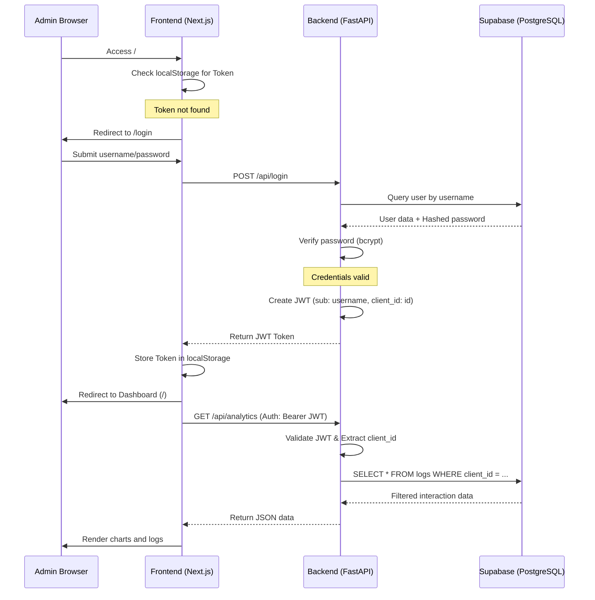
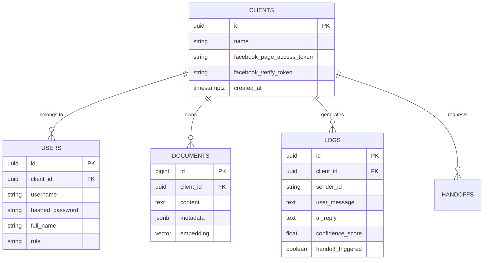

# Project Architecture: Facebook AI RAG Bot with Multi-tenant Admin Dashboard

This document provides a comprehensive overview of the system's architecture, components, and data flows. The system is designed to support multiple clients (multi-tenancy), each with their own knowledge base, interaction logs, and Facebook Messenger configuration.

## 1. System Overview (Tổng quan hệ thống)

The system consists of three main layers:
1.  **Frontend (Next.js):** A modern, dark-mode administrative dashboard for client management.
2.  **Backend (FastAPI):** A high-performance Python API handling RAG logic, authentication, and Messenger webhooks.
3.  **Database (Supabase):** PostgreSQL with `pgvector` for document embeddings and relational data storage.

## 2. Component Breakdown (Chi tiết thành phần)

### 2.1. Backend API (FastAPI)

*   **`main.py`:** The entry point. Handles routing for:
    *   `POST /api/register`: Creates a new client and their first admin user.
    *   `POST /api/login`: Authenticates users and issues JWT tokens.
    *   `GET/POST /webhook/{client_id}`: Dynamic Messenger webhooks for each client.
    *   Protected Admin APIs: `/api/analytics`, `/api/handoffs`, `/api/upload`, `/api/index`.
*   **`auth.py`:** Security core. Handles:
    *   JWT generation and validation (containing `sub` and `client_id`).
    *   Password hashing using `bcrypt`.
    *   FastAPI dependencies for route protection.
*   **`database.py`:** Supabase client integration.
*   **`setup_supabase.sql`:** Definitive schema for the entire database.

### 2.2. Admin Dashboard (Next.js)

*   **`src/app/register/page.tsx`**: Client onboarding. Sets up the organization and admin account.
*   **`src/app/login/page.tsx`**: Secure login interface with JWT handling.
*   **`src/components/SidebarWrapper.tsx`**: Implements Auth Guards. Redirects unauthenticated users to `/login` and hides protected UI.
*   **`src/lib/auth.ts`**: Frontend auth utilities (Token storage in `localStorage`, Logout logic).
*   **`src/app/page.tsx`**: Analytics dashboard fetching data filtered by `client_id`.

## 3. Data Flow Diagrams (Sơ đồ luồng dữ liệu)

### 3.1. Authentication Sequence (Luồng xác thực)



## 4. Database Schema (Lược đồ cơ sở dữ liệu)

### 4.1. Entity Relationship Diagram (Sơ đồ ER)



## 5. Environment Configuration (Cấu hình môi trường)

Create a `.env` file in the root directory:

```env
# Supabase Configuration
SUPABASE_URL=https://your-project.supabase.co
SUPABASE_KEY=your-anon-key

# Security
JWT_SECRET=your_super_secret_random_string
ALGORITHM=HS256
ACCESS_TOKEN_EXPIRE_MINUTES=60

# LLM Providers (Optional)
HUGGINGFACE_API_KEY=hf_...
GROQ_API_KEY=gsk_...
GEMINI_API_KEY=...
```

## 6. Deployment & Operation (Vận hành)

### 6.1. Backend Setup
```bash
pip install fastapi uvicorn python-jose[cryptography] passlib[bcrypt] supabase python-dotenv
uvicorn backend.main:app --reload
```

### 6.2. Frontend Setup
```bash
cd admin-dashboard
npm install
npm run dev
```

### 6.3. Creating a Client
1. Navigate to `http://localhost:3000/register`.
2. Fill in organization and admin details.
3. Use the resulting `client_id` for your Facebook Webhook URL: `http://your-domain.com/webhook/{client_id}`.

## 7. Future Roadmap (Lộ trình phát triển)

- **Cloud Storage Integration:** Move document uploads from local disk to Supabase Storage for better scalability.
- **Role-Based Access Control (RBAC):** Add support for `Viewer` and `Manager` roles within each client.
- **Per-Client LLM Choice:** Allow clients to select between different LLM providers (Groq, Gemini, HF) in their dashboard settings.
- **Custom Chatbot Branding:** Allow clients to customize the bot's tone and persona via the dashboard.
