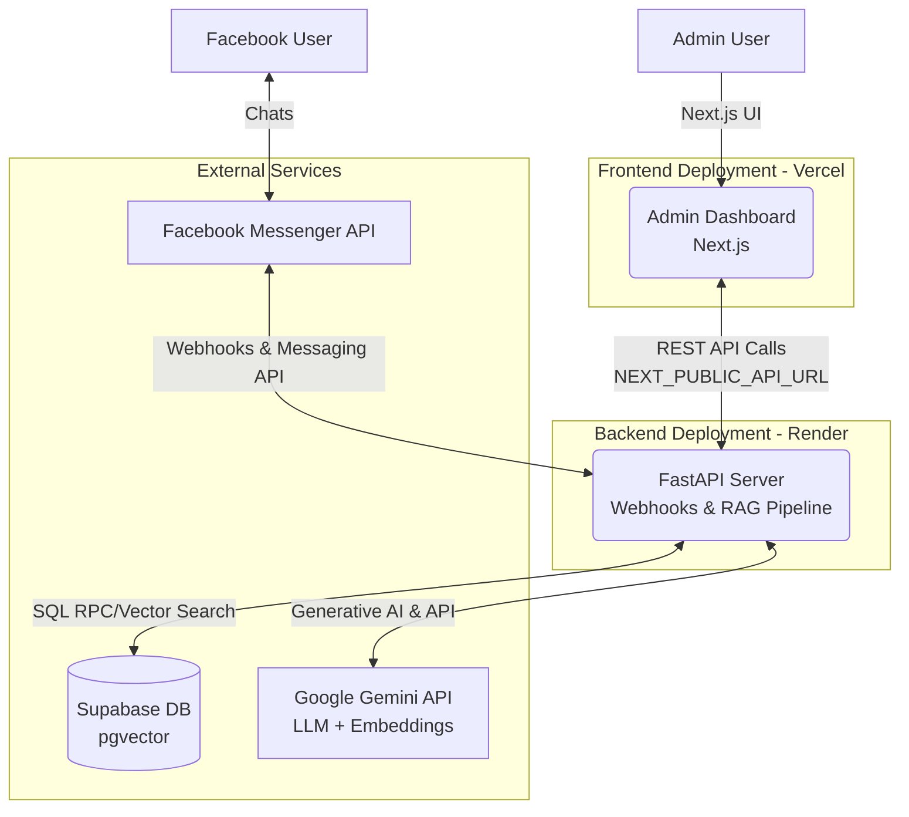

# Deployment Instructions & Architecture

## 🏗️ System Architecture

Below is the architecture showing how the Frontend, Backend, Database, and external APIs communicate with each other in production.



---

## 🚀 1. Deploying the Backend to Render

1. Log in to [Render](https://render.com/) and click **New+** -> **Web Service**.
2. Connect your GitHub repository (`facebookchatbot-rag`).
3. Set up the service with the following configuration:
   * **Name**: `facebook-chatbot-backend` (or pick an appropriate name)
   * **Language**: `Python`
   * **Root Directory**: `.` (Leave empty so it uses the root directory)
   * **Build Command**: `pip install -r requirements.txt`
   * **Start Command**: `uvicorn backend.main:app --host 0.0.0.0 --port 10000`
4. Click **Advanced** and add the following **Environment Variables**:
   * `GEMINI_API_KEY` = `your_gemini_api_key_here`
   * `SUPABASE_URL` = `your_supabase_url`
   * `SUPABASE_KEY` = `your_supabase_service_role_key`
5. Click **Create Web Service**. Wait for the build to finish.
6. Copy the resulting Render domain URL (e.g., `https://facebook-chatbot-backend.onrender.com`).

*Important: Once deployed, remember to go to your Facebook Developer Portal and update your Messenger Webhook URL to point to this new Render URL (e.g., `https://facebook-chatbot-backend.onrender.com/webhook`).*

---

## 🌐 2. Deploying the Frontend to Vercel

1. Log in to [Vercel](https://vercel.com/) and click **Add New...** -> **Project**.
2. Import your `facebookchatbot-rag` GitHub repository.
3. Configure the project:
   * **Project Name**: `admin-dashboard`
   * **Framework Preset**: `Next.js`
   * **Root Directory**: Click "Edit" and select the `admin-dashboard` folder.
4. Expand the **Environment Variables** section and add:
   * `NEXT_PUBLIC_API_URL` = `https://facebook-chatbot-backend.onrender.com` (Paste the exact URL Render gave you in step 1).
5. Click **Deploy**. Vercel will automatically detect the Next.js setup and run `npm run build`.

---

## 🔗 3. Connecting Them Together

To ensure the frontend and backend communicate securely and dynamically in production, you'll need to modify two small things in your codebase (if you haven't already):

### **On the Frontend (`admin-dashboard`)**
Instead of hardcoding `http://localhost:8000` for your API calls, use the environment variable you set in Vercel. 
Example inside a page or component:
```typescript
// It will use the Vercel env var in prod, and localhost locally
const API_URL = process.env.NEXT_PUBLIC_API_URL || "http://localhost:8000";

const res = await fetch(`${API_URL}/api/analytics`);
```

### **On the Backend (`backend/main.py`)**
Update your CORS configuration to allow the Vercel frontend URL to request data without being blocked by browser security.
```python
from fastapi.middleware.cors import CORSMiddleware

app.add_middleware(
    CORSMiddleware,
    # Replace the wildcard with your specific Vercel frontend URL
    allow_origins=[
        "http://localhost:3000", 
        "https://your-vercel-project-name.vercel.app"
    ],
    allow_credentials=True,
    allow_methods=["*"],
    allow_headers=["*"],
)
```